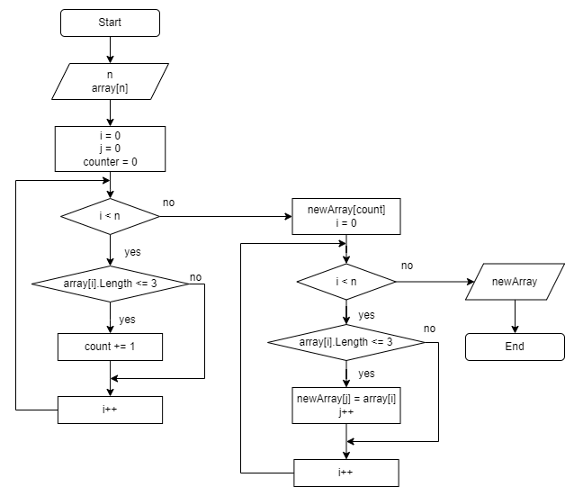

# FinalWorkGB
## Задание
1. Создать репозиторий на GitHub;
2. Нарисовать блок-схему алгоритма;
3. Снабдить репозиторий оформленным текстовым описанием решения;
4. Написать программу, решающую поставленную задачу;
5. Использовать контроль версий в работе над этим проектом.

## Задача
> Написать программу, которая из имеющегося массива строк формирует массив из строк, длина которых меньше либо равна 3 символа. Первоначальный массив можно ввести с клавиатуры, либо задать на старте выполнения алгоритма. При решении не рекомендуется пользоваться коллекциями, лучше обойтись исключительно массивами.

## Блок-схема 

## Алгоритм решения поставленной задачи
1. Массив заполняется пользователем с клавиатуры.
2. Реализация метода, определяющего длину массива, основанного на введенном пользователем:
    + Осуществляется перебор элементов массива. В случае если длина массива меньше или равна 3, значение переменной счетчика увеличивается. Метод вернет переменную счетчик, которая определяет длину нового массива.
3. Реализуем метод формирующий новый массив с подходящими значениями:
    + Осуществляется проход по исходному массиву;
    + Если элемент массива удовлетворяет заданным условиям, записываем его новый массив;
    + Метод возвращает новый массив.
4. Осуществляем вывод нового массива.